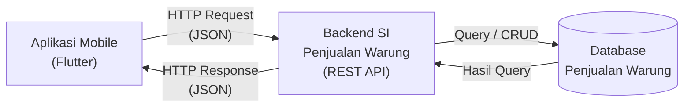

<<<<<<< HEAD
# Tugas 1 — Identifikasi Kebutuhan Aplikasi Bergerak

**Nama:** Ade Yusup Maulana
**NIM:** 230660221009
**Program Studi:** Sistem Informasi
**Mata Kuliah:** Pemrograman Aplikasi Bergerak
**Tugas:** Tugas 1 — Identifikasi Kebutuhan Aplikasi Bergerak

---

## 1. Deskripsi Sistem

Sistem Informasi Penjualan Warung merupakan aplikasi mobile yang digunakan oleh pemilik atau pengelola warung untuk membantu pencatatan dan pemantauan transaksi penjualan secara digital. Pada proses saat ini, pencatatan transaksi masih dapat dilakukan secara manual sehingga data penjualan berisiko tercecer, sulit dicari kembali, dan membutuhkan waktu ketika pemilik ingin mengetahui riwayat transaksi atau total penjualan. Aplikasi mobile dipilih karena pengelola warung membutuhkan konteks bergerak, yaitu dapat mencatat transaksi ketika sedang melayani pelanggan, serta membutuhkan sesi penggunaan singkat karena transaksi harus dapat dicatat dengan cepat tanpa melalui proses yang panjang.

---

## 2. Diagram Arsitektur

Diagram arsitektur sistem menggambarkan hubungan antara aplikasi mobile Flutter, backend SI, dan database penjualan warung.

### Alur Sistem

```text
┌──────────────────────────┐
│     Aplikasi Mobile      │
│         Flutter          │
│                          │
│ - Dashboard              │
│ - Transaksi              │
│ - Produk                 │
│ - Riwayat Penjualan      │
└────────────┬─────────────┘
             │
       HTTP Request
          (JSON)
             ▼
┌──────────────────────────┐
│       Backend SI         │
│    Penjualan Warung      │
│       REST API           │
└────────────┬─────────────┘
             │
       Query / CRUD
             ▼
┌──────────────────────────┐
│         Database         │
│     Penjualan Warung     │
│                          │
│ - Produk                 │
│ - Transaksi              │
│ - Detail Transaksi       │
└────────────┬─────────────┘
             │
       Hasil Query
             ▼
┌──────────────────────────┐
│       Backend SI         │
└────────────┬─────────────┘
             │
       HTTP Response
          (JSON)
             ▼
┌──────────────────────────┐
│     Aplikasi Mobile      │
│         Flutter          │
└──────────────────────────┘
```

### Source Mermaid

File sumber diagram disimpan sebagai:

`diagram.mmd`

Isi file `diagram.mmd`:



Diagram kemudian diekspor menjadi:

`diagram.png`

---

## 3. Tabel Kebutuhan

| No. | Permintaan                                                                                 | Pengguna                 | Karakteristik Mobile yang Terkait                                                                     | Fitur Aplikasi                                                   | Materi Pemenuh               |
| --- | ------------------------------------------------------------------------------------------ | ------------------------ | ----------------------------------------------------------------------------------------------------- | ---------------------------------------------------------------- | ---------------------------- |
| 1   | Pengguna ingin melihat daftar produk yang tersedia di warung                               | Pemilik/Pengelola        | Sesi penggunaan singkat, karena informasi produk perlu dilihat dengan cepat saat melayani pelanggan   | Halaman daftar produk, pencarian produk, detail produk           | UI/UX & Navigasi             |
| 2   | Pengguna ingin mencatat transaksi penjualan secara cepat                                   | Pemilik/Pengelola        | Konteks bergerak, karena transaksi dapat dilakukan sambil bergerak atau melayani pelanggan            | Form transaksi, pemilihan produk, jumlah barang, total harga     | Form, Validasi & Navigasi    |
| 3   | Pengguna ingin melihat riwayat transaksi penjualan                                         | Pemilik/Pengelola        | Sesi penggunaan singkat, karena pengguna membutuhkan informasi transaksi tanpa proses yang panjang    | Halaman riwayat transaksi, detail transaksi, pencarian transaksi | Data & Navigasi              |
| 4   | Pengguna ingin mengetahui total atau ringkasan penjualan                                   | Pemilik/Pengelola        | Layar kecil, sehingga informasi perlu disajikan secara ringkas dan mudah dibaca pada perangkat mobile | Dashboard, total transaksi, total penjualan                      | UI/UX & Data                 |
| 5   | Pengguna ingin data transaksi tetap dapat ditampilkan ketika koneksi internet tidak stabil | Pemilik/Pengelola        | Konektivitas terbatas, karena koneksi internet di lingkungan warung dapat berubah-ubah                | Penyimpanan data lokal/cache dan sinkronisasi data               | Data Lokal & REST API        |
| 6   | Pengguna ingin memasukkan data produk baru atau mengubah data produk                       | Pemilik/Pengelola        | Interaksi sentuh, karena proses input dilakukan melalui form dan tombol pada layar smartphone         | Form tambah produk, edit produk, validasi input                  | Form, Validasi & CRUD        |
| 7   | Sistem harus menyimpan dan mengelola data produk, transaksi, dan detail transaksi          | Backend/Pengelola Sistem | Konektivitas terbatas, karena aplikasi mobile berkomunikasi dengan backend melalui jaringan           | REST API dan database untuk penyimpanan data                     | REST API & Database          |
| 8   | Petugas/backend mengelola struktur dan keamanan database sistem                            | Admin/Backend            | Di luar lingkup aplikasi mobile, karena pengelolaan database dilakukan pada sisi server               | Pengelolaan database, API dan autentikasi                        | Di luar lingkup (backend SI) |

### Catatan

Baris nomor 8 dimasukkan karena kebutuhan tersebut tidak menjadi tugas utama aplikasi mobile.

Hal ini menunjukkan batas antara:

**Flutter Mobile**

* Tampilan
* Form
* Navigasi
* Input
* Transaksi
* Dashboard

dan:

**Backend SI**

* REST API
* Database
* Pengolahan data
* Pengelolaan data server
* Autentikasi

---

## 4. Bukti Environment Siap

Folder bukti environment disusun sebagai berikut:

```text
flutter-doctor/
├── sebelum.png
└── sesudah.png
```

### sebelum.png

`sebelum.png` merupakan screenshot ketika menjalankan:

```bash
flutter doctor -v
```

Screenshot menunjukkan kondisi environment Flutter sebelum perbaikan.

### sesudah.png

`sesudah.png` merupakan screenshot setelah dilakukan perbaikan environment Flutter dengan menjalankan kembali:

```bash
flutter doctor -v
```

Pada kondisi akhir, Flutter, Windows, Chrome, connected device, dan network resources telah terdeteksi dengan baik.

Android SDK dan Visual Studio belum terpasang karena pengembangan aplikasi pada tahap ini menggunakan Chrome sebagai target Flutter Web.

### aplikasi.png

`aplikasi.png` merupakan screenshot aplikasi Flutter yang berhasil dijalankan pada Chrome.

Screenshot ini digunakan sebagai bukti bahwa environment Flutter telah dapat digunakan untuk menjalankan aplikasi.

---

## 5. Refleksi

Fitur perangkat yang paling relevan untuk Sistem Informasi Penjualan Warung adalah kamera, karena dapat digunakan untuk membantu mengambil gambar produk yang akan ditampilkan pada data produk. Penggunaan kamera dapat membuat proses pengelolaan katalog produk menjadi lebih praktis karena pengelola dapat mengambil foto produk langsung melalui smartphone. Fitur ini juga sesuai dengan karakteristik aplikasi bergerak karena kamera tersedia pada perangkat mobile dan dapat digunakan secara langsung ketika pengelola berada di warung.

---

## 6. Struktur Berkas Pengumpulan

```text
230660221009-Ade-Yusup-Maulana/
│
├── README.md
├── diagram.png
├── diagram.mmd
├── aplikasi.png
│
└── flutter-doctor/
    ├── sebelum.png
    └── sesudah.png
```

---

## Kesimpulan

Tugas ini menghasilkan identifikasi kebutuhan untuk Sistem Informasi Penjualan Warung yang dirancang sebagai aplikasi mobile menggunakan Flutter. Identifikasi mencakup deskripsi sistem, arsitektur aplikasi, kebutuhan pengguna, karakteristik aplikasi bergerak, serta bukti kesiapan environment Flutter. Pengembangan selanjutnya dapat dilakukan dengan mengimplementasikan fitur produk, transaksi, riwayat penjualan, REST API, dan database sesuai kebutuhan yang telah diidentifikasi.
=======
# SI-VIIA-Mobile
>>>>>>> c8c214480c46a4e576067b94470d7dc357b3c180
