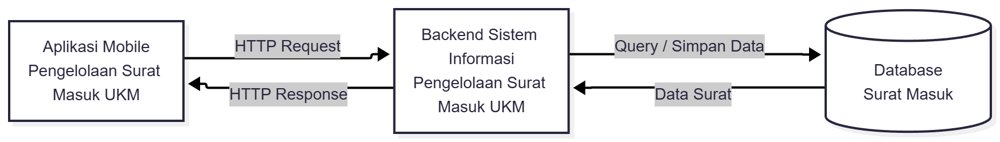
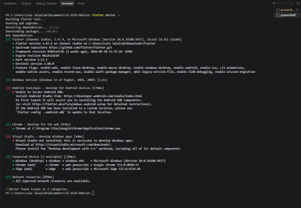
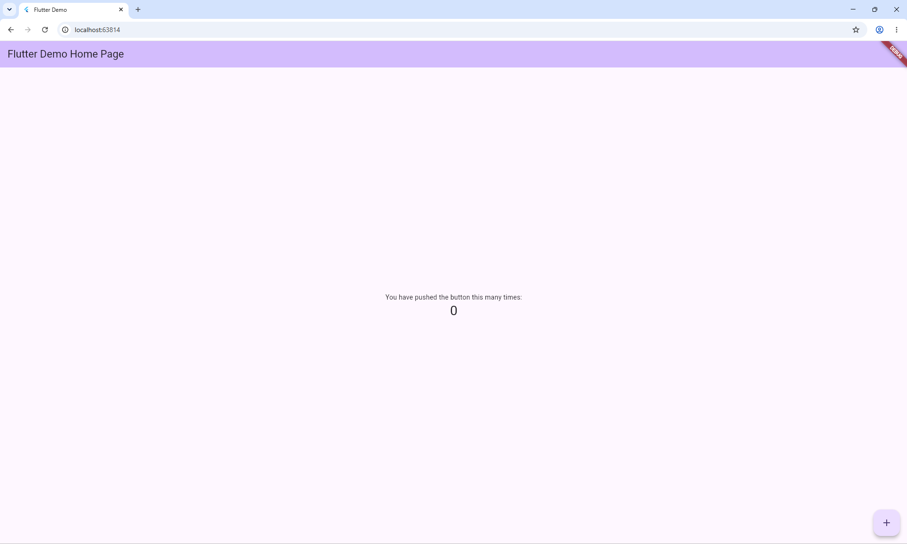

# Tugas 1 — Aplikasi Pengelolaan Surat Masuk UKM

**Nama:** Lala Jalaliah  
**NIM:** 230660221019

## 1. Pilih Satu Domain Sistem Informasi

**Domain yang dipilih: Pengelolaan Surat Masuk UKM**

Aplikasi Pengelolaan Surat Masuk UKM merupakan aplikasi mobile yang ditujukan untuk anggota/pengurus dan sekretaris UKM dalam mencatat serta mengarsipkan surat masuk secara terpusat. Saat ini, surat masuk dapat diterima oleh anggota yang berbeda dan terkadang hanya dibagikan melalui grup Humas, sehingga pencatatan dan pencarian kembali surat menjadi kurang teratur. Aplikasi mobile diperlukan karena anggota dapat menerima surat ketika berada di berbagai tempat sehingga sesuai dengan karakteristik **konteks bergerak**, serta proses pencatatan surat perlu dilakukan dengan cepat melalui perangkat yang digunakan sehari-hari sehingga sesuai dengan karakteristik **sesi penggunaan singkat**. Melalui aplikasi ini, anggota dapat mencatat dan mengunggah surat yang diterima, sedangkan sekretaris dapat melihat, mencari, memeriksa, dan mengarsipkan surat masuk secara lebih teratur.

## 2. Kelima Komponen Tugas

### 2.1 Deskripsi Sistem

Aplikasi Pengelolaan Surat Masuk UKM merupakan aplikasi mobile yang ditujukan untuk anggota/pengurus dan sekretaris UKM dalam mencatat serta mengarsipkan surat masuk secara terpusat. Saat ini, surat masuk dapat diterima oleh anggota yang berbeda dan terkadang hanya dibagikan melalui grup Humas, sehingga pencatatan dan pencarian kembali surat menjadi kurang teratur. Aplikasi mobile diperlukan karena anggota dapat menerima surat ketika berada di berbagai tempat sehingga sesuai dengan karakteristik **konteks bergerak**, serta proses pencatatan surat perlu dilakukan dengan cepat melalui perangkat yang digunakan sehari-hari sehingga sesuai dengan karakteristik **sesi penggunaan singkat**. Melalui aplikasi ini, anggota dapat mencatat dan mengunggah surat yang diterima, sedangkan sekretaris dapat melihat, mencari, memeriksa, dan mengarsipkan surat masuk secara lebih teratur.

### 2.2 Diagram Arsitektur

Diagram arsitektur Aplikasi Pengelolaan Surat Masuk UKM menggambarkan komunikasi antara aplikasi mobile, backend sistem informasi, dan database. Aplikasi mobile mengirimkan **HTTP Request** ke backend untuk melakukan proses seperti menyimpan, mengambil, mencari, dan mengelola data surat. Backend kemudian berkomunikasi dengan database untuk mengakses data yang diperlukan dan mengirimkan **HTTP Response** kembali ke aplikasi mobile.

**Gambar 1. Diagram Arsitektur Aplikasi Pengelolaan Surat Masuk UKM**

### 2.3 Tabel Kebutuhan

| No. | Permintaan | Pengguna | Karakteristik Mobile yang Terkait | Fitur Aplikasi | Materi Pemenuh |
|---|---|---|---|---|---|
| 1 | Pengguna dapat mencatat surat yang diterima | Anggota/Pengurus | Konteks bergerak, sesi penggunaan singkat | Form tambah surat masuk | Minggu 5–6 |
| 2 | Pengguna dapat mengunggah file atau foto surat yang diterima | Anggota/Pengurus | Konteks bergerak, variasi perangkat | Upload file/foto surat | Minggu 9–11 |
| 3 | Sekretaris dapat melihat daftar seluruh surat masuk yang telah dicatat | Sekretaris | Layar kecil, sesi penggunaan singkat | Halaman daftar surat masuk | Minggu 3, 5–6 |
| 4 | Sekretaris dapat melihat informasi lengkap setiap surat | Sekretaris | Layar kecil, interaksi sentuh | Halaman detail surat | Minggu 3, 5–6 |
| 5 | Sekretaris dapat mencari surat berdasarkan informasi tertentu | Sekretaris | Sesi penggunaan singkat | Fitur pencarian surat | Minggu 6, 9–10 |
| 6 | Sekretaris dapat mengetahui ketika ada surat baru yang dicatat | Sekretaris | Notifikasi, konteks bergerak | Notifikasi surat masuk | Minggu 11 |
| 7 | Sekretaris dapat mengetahui status surat yang sudah diperiksa atau belum | Sekretaris | Sesi penggunaan singkat | Status surat | Minggu 6–7, 9–10 |
| 8 | Sistem dapat menyimpan data dan file surat secara terpusat | Anggota/Pengurus & Sekretaris | Konektivitas terbatas | Penyimpanan data dan file surat | Minggu 7, 9–10 |
| 9 | Pengelolaan database surat dilakukan oleh sistem backend | Admin/Backend | — | Pengelolaan database | Di luar lingkup (Backend SI) |

### 2.4 Bukti Environment Siap

#### 2.4.1 Flutter Doctor Sebelum Perbaikan

**Gambar 2. Hasil `flutter doctor -v` sebelum perbaikan**

#### 2.4.2 Flutter Doctor Sesudah Perbaikan

**Gambar 3. Hasil `flutter doctor -v` sesudah perbaikan**

#### 2.4.3 Aplikasi Flutter Berjalan

**Gambar 4. Aplikasi Flutter berhasil dijalankan**

### 2.5 Refleksi

Fitur perangkat yang paling relevan untuk aplikasi Pengelolaan Surat Masuk UKM adalah **kamera**, karena pengguna dapat langsung mendokumentasikan surat fisik yang diterima. Fitur tersebut memudahkan anggota atau pengurus mencatat surat tanpa harus menggunakan perangkat lain untuk memindai dokumen. Selain itu, penggunaan kamera mendukung kondisi pengguna yang dapat menerima surat di berbagai tempat sehingga proses pencatatan dan pengarsipan dapat dilakukan dengan lebih cepat.