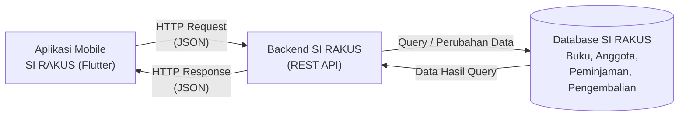

# Tugas 1 — Identifikasi Kebutuhan Aplikasi Bergerak

## SI RAKUS — Sistem Rak Kampus

### Identitas

| Keterangan | Data |
|---|---|
| Nama | Wendi Feriyanda |
| NIM | 230660221026 |
| Program Studi | Sistem Informasi |
| Domain | Perpustakaan Kampus |
| Nama Aplikasi | SI RAKUS (Sistem Rak Kampus) |
| Platform | Mobile |
| Framework | Flutter |

---

# 1. Deskripsi Sistem

SI RAKUS (Sistem Rak Kampus) adalah rancangan aplikasi mobile yang ditujukan untuk membantu mahasiswa dalam mencari buku, melihat ketersediaan buku, dan mengetahui riwayat peminjaman di perpustakaan kampus. Selain mahasiswa sebagai pengguna utama, petugas perpustakaan juga terlibat dalam pengelolaan data buku, anggota, dan transaksi peminjaman. Permasalahan yang ingin dibantu oleh sistem ini adalah mahasiswa sering membutuhkan informasi buku dengan cepat sehingga tidak harus datang ke perpustakaan hanya untuk mengecek ketersediaan buku atau melihat informasi peminjaman. Aplikasi mobile dipilih karena mahasiswa dapat mengakses informasi perpustakaan dalam **konteks bergerak**, misalnya saat berada di lingkungan kampus atau di luar perpustakaan, serta menggunakan **interaksi sentuh dan tampilan yang sederhana** sehingga informasi dapat diakses dengan cepat dalam waktu penggunaan yang singkat.

---

# 2. Diagram Arsitektur

Secara umum, SI RAKUS terdiri dari aplikasi mobile, backend sistem informasi, dan database. Aplikasi mobile digunakan oleh mahasiswa untuk mengirim permintaan ke backend, kemudian backend mengambil atau mengubah data pada database dan mengirimkan hasilnya kembali ke aplikasi.

### Alur komunikasi

**Aplikasi Mobile → HTTP Request → Backend SI → Database → HTTP Response → Aplikasi Mobile**



File sumber diagram:

`diagram.mmd`

File hasil export:

`diagram.png`

---

# 3. Tabel Kebutuhan

| No. | Permintaan | Pengguna | Karakteristik Mobile yang Terkait | Fitur Aplikasi | Materi Pemenuh |
|:---:|---|---|---|---|---|
| 1 | Saya ingin bisa masuk ke aplikasi menggunakan akun saya | Mahasiswa | Sesi penggunaan singkat | Halaman login dan validasi akun | Minggu 2–3 |
| 2 | Saya ingin mencari buku berdasarkan judul atau kata kunci | Mahasiswa | Konteks bergerak | Fitur pencarian dan daftar buku | Minggu 3–4 |
| 3 | Saya ingin melihat informasi dan ketersediaan buku | Mahasiswa | Layar kecil dan konteks bergerak | Halaman detail buku dan status ketersediaan | Minggu 4 |
| 4 | Saya ingin melihat buku yang pernah saya pinjam | Mahasiswa | Sesi penggunaan singkat | Halaman riwayat peminjaman | Minggu 5 |
| 5 | Saya ingin mengetahui buku yang masih saya pinjam | Mahasiswa | Konteks bergerak | Halaman peminjaman aktif | Minggu 5–6 |
| 6 | Saya ingin mendapatkan pengingat ketika waktu pengembalian buku sudah dekat | Mahasiswa | Notifikasi dan konteks bergerak | Notifikasi pengembalian buku | Minggu 7 |
| 7 | Saya ingin tetap bisa melihat data tertentu ketika koneksi internet tidak stabil | Mahasiswa | Konektivitas terbatas | Penyimpanan data secara lokal | Minggu 6–7 |
| 8 | Saya ingin mengelola data buku, anggota, dan transaksi perpustakaan | Petugas Perpustakaan | Tidak termasuk fokus aplikasi mobile | Pengelolaan data melalui backend SI | Di luar lingkup (backend SI) |

---

# 4. Ruang Lingkup Aplikasi Mobile

Pada project SI RAKUS, aplikasi mobile lebih difokuskan pada kebutuhan mahasiswa sebagai pengguna utama.

### Fitur yang direncanakan untuk aplikasi mobile

- Login mahasiswa
- Mencari buku
- Melihat daftar buku
- Melihat detail buku
- Melihat ketersediaan buku
- Melihat peminjaman yang sedang berlangsung
- Melihat riwayat peminjaman
- Menerima notifikasi pengingat pengembalian
- Menyimpan data tertentu secara lokal saat koneksi tidak stabil

### Fitur di luar aplikasi mobile

Pengelolaan data buku, data anggota, serta transaksi yang dilakukan oleh petugas perpustakaan termasuk ke dalam bagian **backend Sistem Informasi**. Karena itu, bagian tersebut tidak menjadi fokus utama aplikasi mobile pada tugas ini.

---

# 5. Pengguna Sistem

SI RAKUS mempunyai dua pengguna utama, yaitu mahasiswa dan petugas perpustakaan.

### 5.1 Mahasiswa

Mahasiswa menggunakan SI RAKUS untuk:

- login ke aplikasi;
- mencari buku;
- melihat detail buku;
- mengecek ketersediaan buku;
- melihat peminjaman yang sedang berlangsung;
- melihat riwayat peminjaman;
- mendapatkan notifikasi pengembalian.

### 5.2 Petugas Perpustakaan

Petugas perpustakaan berperan dalam mengelola data dan transaksi perpustakaan, seperti:

- mengelola data buku;
- mengelola data anggota;
- mengelola peminjaman;
- mengelola pengembalian;
- mengelola denda;
- mengelola data melalui backend Sistem Informasi.

---

# 6. Alur Umum SI RAKUS

Secara sederhana, alur penggunaan SI RAKUS oleh mahasiswa adalah sebagai berikut:

```text
Mahasiswa
    ↓
Login
    ↓
Dashboard
    ↓
┌─────────────────────────────┐
│ Menu Utama                  │
├─────────────────────────────┤
│ Cari Buku                   │
│ Detail Buku                 │
│ Ketersediaan Buku           │
│ Peminjaman Saya             │
│ Riwayat Peminjaman          │
│ Notifikasi                  │
└─────────────────────────────┘
    ↓
Mendapatkan Informasi Perpustakaan
```

Dalam prosesnya, aplikasi mobile akan berkomunikasi dengan backend menggunakan HTTP Request dan HTTP Response dengan format data JSON.

---

# 7. Fitur Perangkat yang Relevan

Fitur perangkat yang paling sesuai untuk SI RAKUS adalah **notifikasi** karena dapat digunakan untuk mengingatkan mahasiswa tentang batas waktu pengembalian buku. Dengan notifikasi, mahasiswa tidak perlu selalu membuka aplikasi hanya untuk mengecek apakah sudah waktunya mengembalikan buku. Fitur ini juga sesuai dengan penggunaan aplikasi mobile yang memungkinkan pengguna mendapatkan informasi secara langsung melalui perangkat yang mereka gunakan.

---

# 8. Bukti Environment

Bukti bahwa environment Flutter sudah disiapkan dimasukkan ke dalam folder `flutter-doctor/`.

### 8.1 Sebelum Perbaikan

File:

`flutter-doctor/sebelum.png`

Berisi hasil perintah:

```bash
flutter doctor -v
```

yang menunjukkan kondisi environment sebelum diperbaiki.

### 8.2 Sesudah Perbaikan

File:

`flutter-doctor/sesudah.png`

Berisi hasil perintah:

```bash
flutter doctor -v
```

setelah environment Flutter sudah disiapkan.

### 8.3 Aplikasi Berhasil Berjalan

File:

`aplikasi.png`

Berisi screenshot aplikasi Flutter sederhana yang berhasil dijalankan pada target yang digunakan.

---

# 9. Struktur Repository

```text
tugas-1/
└── 230660221026-Wendi-Feriyanda/
    │
    ├── README.md
    ├── diagram.png
    ├── diagram.mmd
    │
    ├── flutter-doctor/
    │   ├── sebelum.png
    │   └── sesudah.png
    │
    └── aplikasi.png
```

---

# 10. Rencana Pengembangan SI RAKUS

SI RAKUS direncanakan untuk dikembangkan secara bertahap mengikuti materi yang diberikan pada mata kuliah Pemrograman Aplikasi Bergerak.

```text
Identifikasi Kebutuhan
        ↓
Perancangan UI/UX
        ↓
Membuat Tampilan Flutter
        ↓
Navigasi Antarhalaman
        ↓
Penyimpanan Data Lokal
        ↓
REST API
        ↓
Integrasi Backend
        ↓
Fitur Perangkat
        ↓
Testing
        ↓
Perbaikan dan Penyempurnaan
        ↓
UAS
```

Dengan tahapan tersebut, hasil dari Tugas 1 dapat digunakan sebagai dasar untuk mengembangkan project SI RAKUS pada tugas-tugas berikutnya sampai UAS.

---

# 11. Kesimpulan

SI RAKUS dirancang sebagai aplikasi mobile yang membantu mahasiswa mendapatkan informasi perpustakaan dengan lebih mudah, terutama dalam mencari buku dan memantau peminjaman. Pada tahap awal ini, fokus utama project adalah mengidentifikasi pengguna, masalah, kebutuhan aplikasi mobile, serta hubungan antara aplikasi, backend, dan database. Rancangan ini nantinya menjadi dasar untuk pengembangan SI RAKUS secara bertahap sesuai dengan materi Pemrograman Aplikasi Bergerak.