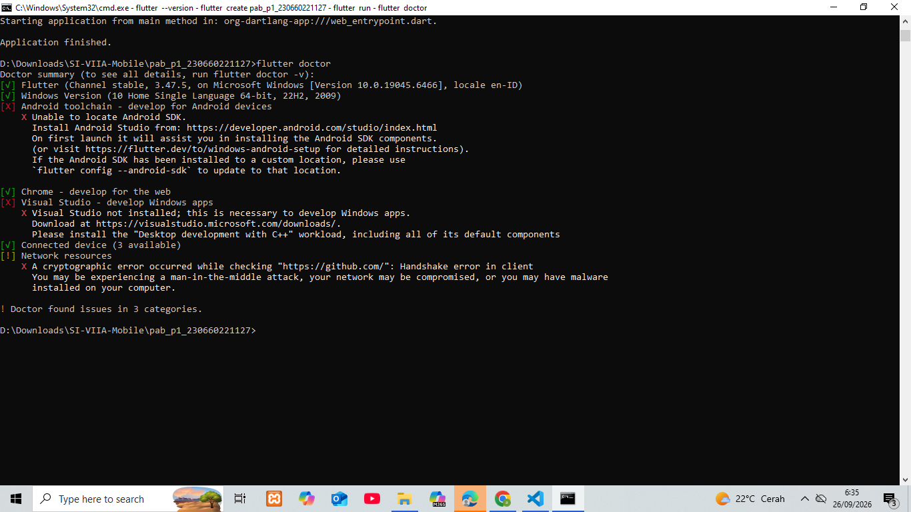
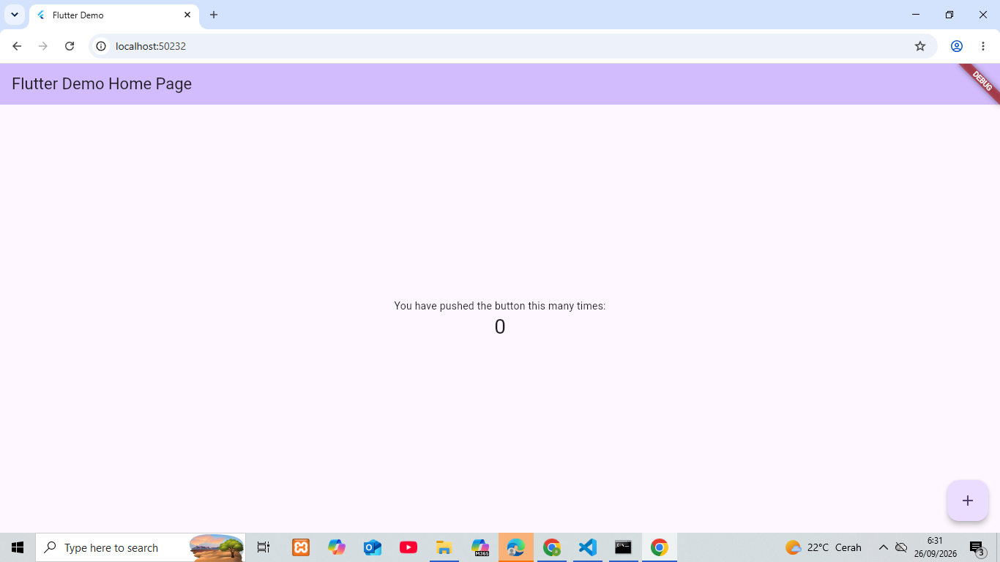

# Tugas 1 — Identifikasi Kebutuhan Aplikasi Bergerak

**Nama:** Amelia Oktaviani  
**NIM:** 230660221127  
**Mata Kuliah:** Pemrograman Aplikasi Bergerak  
**Domain:** Usaha Mikro — Warung  
**Nama Aplikasi:** Aplikasi Mobile Pengelolaan Penjualan Warung

---

## 1. Deskripsi Sistem

Aplikasi Mobile Pengelolaan Penjualan Warung ditujukan bagi pemilik atau penjaga warung untuk membantu proses pencatatan transaksi penjualan dan pemantauan stok barang. Pada proses bisnis saat ini, pencatatan transaksi dan stok masih dilakukan secara manual sehingga pemilik atau penjaga warung mengalami kesulitan dalam mengetahui riwayat penjualan dan kondisi stok barang secara cepat. Aplikasi mobile dipilih karena dapat digunakan langsung saat melayani pelanggan dengan interaksi sentuh yang sederhana serta mendukung sesi penggunaan singkat sehingga pencatatan transaksi dapat dilakukan dengan cepat tanpa harus menggunakan komputer. Aplikasi akan menyediakan fitur pencatatan transaksi, pengelolaan data barang, pemantauan stok, dan riwayat penjualan, sedangkan pengelolaan data pada sisi server menjadi bagian dari backend Sistem Informasi.

---

## 2. Diagram Arsitektur

Arsitektur sistem aplikasi pengelolaan penjualan warung menggunakan komunikasi antara aplikasi mobile dengan backend Sistem Informasi melalui HTTP Request dan HTTP Response. Backend bertugas memproses permintaan dari aplikasi mobile serta mengakses database untuk menyimpan dan mengambil data.

### Alur Arsitektur

```text
Aplikasi Mobile Warung
        │
        │ HTTP Request
        ▼
Backend SI Warung
        │
        │ Request Data
        ▼
Database
        │
        │ Data
        ▼
Backend SI Warung
        │
        │ HTTP Response
        ▼
Aplikasi Mobile Warung
```

### Komponen Sistem

1. **Aplikasi Mobile Warung**
   - Mencatat transaksi penjualan
   - Melihat daftar barang
   - Melihat stok barang
   - Melihat riwayat penjualan
   - Menerima notifikasi stok

2. **Backend SI Warung**
   - Memproses permintaan aplikasi mobile
   - Menyediakan REST API
   - Mengelola proses transaksi
   - Menghubungkan aplikasi dengan database

3. **Database**
   - Menyimpan data barang
   - Menyimpan data transaksi
   - Menyimpan data stok
   - Menyimpan data pengguna

### File Diagram

Diagram arsitektur tersedia pada:

- `diagram.png`
- `diagram.mmd`

---

## 3. Tabel Kebutuhan

| No. | Permintaan | Pengguna | Karakteristik Mobile yang Terkait | Fitur Aplikasi | Materi Pemenuh |
|---|---|---|---|---|---|
| 1 | Mencatat transaksi penjualan dengan cepat | Pemilik/Penjaga Warung | Interaksi sentuh dan sesi penggunaan singkat karena transaksi perlu dicatat langsung saat melayani pelanggan | Form transaksi dan tombol simpan | UI/Form |
| 2 | Melihat daftar barang dan harga | Pemilik/Penjaga Warung | Layar kecil karena informasi barang perlu ditampilkan secara ringkas dan mudah dibaca pada perangkat mobile | Halaman daftar barang | UI/Navigasi |
| 3 | Mengetahui jumlah stok barang | Pemilik/Penjaga Warung | Sesi penggunaan singkat karena stok perlu diperiksa dengan cepat | Halaman stok barang | Data Lokal/REST API |
| 4 | Melihat riwayat transaksi penjualan | Pemilik/Penjaga Warung | Interaksi sentuh karena pengguna dapat memilih dan melihat data transaksi melalui perangkat mobile | Halaman riwayat transaksi | Navigasi/REST API |
| 5 | Mendapatkan pemberitahuan ketika stok barang menipis | Pemilik/Penjaga Warung | Notifikasi karena pengguna dapat memperoleh informasi tanpa harus selalu membuka aplikasi | Notifikasi stok minimum | Fitur Perangkat |
| 6 | Mengambil foto produk untuk melengkapi data barang | Pemilik/Penjaga Warung | Kamera karena perangkat mobile dapat digunakan untuk mengambil foto produk secara langsung | Fitur kamera/foto produk | Fitur Perangkat |
| 7 | Mengelola dan menyimpan data transaksi pada server | Backend SI | Tidak menjadi karakteristik aplikasi mobile karena proses dilakukan pada sisi server | Di luar lingkup (backend SI) | Backend/REST API |

---

## 4. Bukti Environment Siap

### 4.1 Flutter Doctor Sebelum Perbaikan

Perintah yang digunakan:

```bash
flutter doctor -v
```

Hasil sebelum perbaikan ditampilkan pada gambar berikut:

**File:** `flutter-doctor/sebelum.png`


---

### 4.2 Flutter Doctor Sesudah Perbaikan

Perintah yang digunakan:

```bash
flutter doctor -v
```

Hasil sesudah perbaikan ditampilkan pada gambar berikut:

**File:** `flutter-doctor/sesudah.png`



---

### 4.3 Aplikasi Counter Berjalan

Project Flutter dibuat menggunakan perintah:

```bash
flutter create pab_p1_230660221127
```

Kemudian masuk ke folder project:

```bash
cd pab_p1_230660221127
```

Aplikasi dijalankan menggunakan:

```bash
flutter run -d chrome
```

Hasil aplikasi Counter yang berhasil dijalankan:

**File:** `aplikasi.png`



---

## 5. Refleksi

Fitur perangkat yang paling relevan untuk aplikasi pengelolaan penjualan warung adalah notifikasi. Notifikasi dapat membantu pemilik atau penjaga warung mengetahui ketika stok barang mulai menipis tanpa harus selalu membuka aplikasi untuk memeriksanya. Fitur tersebut relevan karena kondisi stok perlu diketahui dengan cepat agar pengguna dapat melakukan pengisian kembali barang yang hampir habis.

---